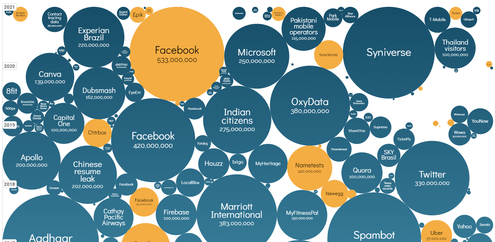
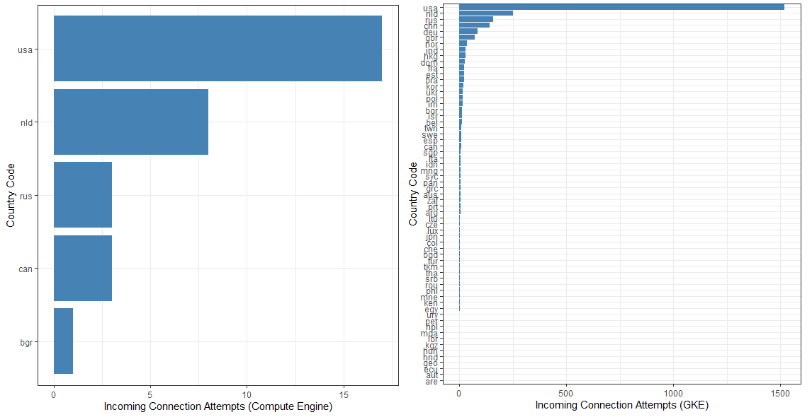
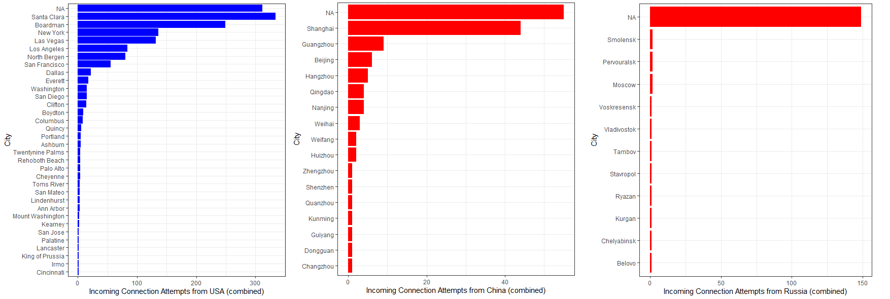

--- 
title: "FMISD13207 Cloud Security Technologies"
author: "Kęstutis Daugėla"
date: "`r Sys.Date()`"
output:
  pdf_document: default
  html_document:
    df_print: paged
bibliography: references.bib
biblio-style: apalike
link-citations: yes
site: bookdown::bookdown_site
citation_package: natbib
---

# Introduction {-}

Information Security Fundamentals (information security problematics, classification and evolution of threats, identification, authentication, access control, security
principals, strategies, models, taxonomies and antologies); Cryptography (simetric and public key cryptography, DES, AES, RSA. stream ciphers, cryptographic
protocols, authentication, electronic signature, management of electronic identity); Network Security (routing, firewalls, VPN, web security, network perimeter
protection, host-level protection, authentication technologies); Attacking Information Technology Systems (attack types, real-life case studies, intrusion detection,
formal analysis techniques); Information Security Technologies (antivirus, IDS, host and perimeter protection systems, Honeypots); Implementing Effective
Information Security Programs (legal, regulatory and privacy issues, security standarts, security best practices, security policy).


The underlying concept of cloud computing was introduced way back in 1960s by John McCarthy in his book, “The challenge of the Computer Utility”. His opinion was that “computation may someday be organized as a public utility.” The rest became history and the majority of the software used now is running in the cloud seamlessly [@CloudHistoryOverview].


Cloud can solve a lot of problems nowadays - starting with reduced cost, enhanced security, and flexible approach [@CloudReview] up to sustainability [@CloudSustainability] and accessibility around the world. Continuous Integration and Deployment (CI/CD) is easier than even treating now only the applications, but the whole infrastructure as code. This leads to enhanced productivity and cost optimization [@CloudAutomation]. 

Is there anything revolutionary in the cloud offerings today? Definitely, no - people used these capabilities for ages. The only difference is the scale and popularity these days.

Cloud services usually are grouped into three categories:

* SaaS (Software as a service) is a software distribution model in which a cloud provider hosts applications and makes them available to end-users over the internet
* PaaS (Platform as a service) is a complete development and deployment environment in the cloud, with resources that enable you to deliver everything from simple cloud-based apps to sophisticated, cloud-enabled enterprise applications
* IaaS (Infrastructure as a service) is a type of cloud computing service that offers essential compute, storage, and networking resources on-demand, on a pay-as-you-go basis


However,  despite  the  gain  achieved  from  cloud computing, organizations are slow in fully accepting it due to security issues and  challenges associated with it [@Cloud-computing]. However, almost every cloud-ready company uses the public cloud (97%) to some extent leaving hybrid cloud setup the dominant one (78%). Companies rarely use public or private cloud alone (19% vs 2% respectively). According to Forbes, there are now 77 % of organizations, having one or some parts of their systems in the cloud. 

Cloud service providers follow a shared security responsibility model, which means that your security team retains some security duties as you migrate applications, data, containers, and workloads to the cloud, while the provider takes part, but not all, of the responsibility. Clearly defining your duties from those of your providers is critical for minimizing the risk of introducing vulnerabilities into your public, hybrid, or multi-cloud systems, as shown in the graph below.


Research
challenges and directions have been categories into 6
groups namely Security, Autonomic Resource
Management (ARM), Cloud Adoption, Cloud
development and benchmarking big data technologies and
cloud computing and social clouds. Security is the most
common challenge of cloud computing. This paper is the
outcome of literature review of over 190 resources
including books, journal and conference papers, research
project reports and deliverables, European Commission
roadmaps and calls for proposals, online weblogs, white
papers, business reviews, company websites, profiles and
offered services by cloud providers. [@cloudsecsurvey]


One of our main findings is that hacking breaches are
the most important in terms of leaked data and in terms of financial impact. We found that the most targeted type of
organisation are medical organisations and BSOs since they possess the most sensitive personal data. Moreover, we
observed that in the recent years the frequency hacking breaches on the two sectors has intensified, with an inter-arrival
time of 4 and 7.5 days respectively. These findings implies taking serious actions to secure personal data especially
for MED and BSO organization [@databreaches]



# Type of attacks

The literature has examined a variety of security flaws[@threats]. To aid readers in comprehending some of the most prevalent cyber security weaknesses, the following are detailed:


* **Malware**. For the previous decade, malware attacks have been the most serious cyber security danger to many enterprises [@malware]. Malware The attacker uses malicious software to gain unauthorized access to computer systems by exploiting their security flaws. Malware is motivated by an extreme financial or political gain, which increases an attacker's drive to compromise as many network devices as possible in order to accomplish their harmful goals. Viruses, worms, trojans, backdoors and adware are but a few examples that fall under the umbrella of malware [@malware2].

* **DDoS**. Cyber security is comprised on three essential components: confidentiality, integrity, and availability. Denial of Service (DoS) attacks and their version, Distributed Denial of Service (DDoS), are conceivable threats that deplete system resources, rendering them inaccessible to authorized users, hence breaching one of the security components—availability. DoS attacks on networks are widespread and have the potential to be catastrophic. Numerous types of DoS attacks have been identified thus far, and the most of them are extremely efficient at disrupting network connectivity. Both IPv4 and IPv6 are quite vulnerable to these attacks [@ddos]. The frequency and scale of attacks have escalated in recent years, from a few megabytes to hundreds of gigabytes. It is difficult to identify these attacks efficiently due to changes in attack patterns or new forms of attacks [@ddos2]. 

* **Phishing** is a very effective approach of cybercrime that criminals use to fool consumers and steal critical data. Since the first phishing assault was disclosed in 1990, the attack vector has grown into a more sophisticated attack vector. At the moment, phishing is regarded to be one of the most prevalent forms of fraud on the Internet. Phishing attacks can result in significant losses for their victims, including sensitive data, identity theft, businesses, and state secrets. [@phishing]

* **SQL Injection Attack (SQLIA)** is one of the most terrifying risks to web applications. Input validation flaws were the cause of a SQL injection attack on the web. SQLIA is a harmful behavior that exploits invalid SQL statements in order to exploit data-driven applications. This vulnerability allows an attacker to exploit manipulated input to gain access to the application's back-end databases through the application's interaction with them. As a result, the attacker can acquire access to the database without obtaining genuine clearance by introducing, changing, or removing key information [@sqlia].

* **Man-in-the-middle**. An attack in which an outsider or third party infiltrates the space between two online users while both users are unaware. In this instance, the malware primarily monitors and has the capacity to modify the information classified exclusively to these two people. Generally, it is referred to as a protocol to refer to an unauthorized user within the system who has the ability to view and modify the system's data without leaving a trail for the system's existing users [@mitm].

* **Cross-site scripting** is a serious issue in Web Applications. With more connected devices that use a variety of Web Applications for various tasks, the potential of XSS assaults grows. By exploiting XSS vulnerabilities in Web applications, hackers can steal victims' session details or other sensitive information[@xss].


* **Zero-day exploit** continue to be a significant security concern to enterprises. When a vendor becomes aware of a zero-day vulnerability, releasing a fix in a timely manner becomes a priority due to the possibility of zero-day exploits. However, we continue to lack knowledge on the factors that influence the time it takes for such vulnerabilities to be patched. It was discovered that while IT companies are quick to release timely updates for zero-day vulnerabilities that affect multiple vendors, products, and versions, vulnerabilities that require privileges and compromise confidentiality are less likely to be patched on time. [@zeroday]. 

* **BEC (Business Email Compromise)** is a sophisticated email fraud scheme that targets firms who deal with international suppliers and frequently transfer payments via wire transfers. BEC attacks are designed to eliminate security protections by capitalizing on flaws in human behavior and decision-making [@BEC]. 

# Data Breach - Case Study

## Twitch

Twitch is a global community that comes together each day to create multiplayer entertainment: unique, live, unpredictable experiences created by the shared interactions of millions. Acquired by Amazon in 2014.


Twitch recently suffered a data breach that, according to security analysts, may have revealed extensive information about the platform's computer code, security vulnerabilities, and payments to content providers. According to the source, the file contained the history of Twitch's source code; proprietary software development kits; an unreleased competitor to Steam, an online games store; programs used by Twitch to test its own security vulnerabilities; and a list of the amount of money earned by each of the site's streamers since 2019 [NY Times - A ‘potentially disastrous’ data breach hits Twitch, the livestreaming site](https://www.nytimes.com/2021/10/06/technology/twitch-data-breach.html)

As another security proffessional indicates in [medium.com - Thoughts on the Twitch Breach](https://medium.com/cloud-security/thoughts-on-the-twitch-breach-a2840470387b): the attackers did not gain access through a zero-day vulnerability or a supply chain assault. Something existed in a state that was not compliant with or anticipated of it.

It appears that the problem was a misconfiguration as this statement says something was in error. The attackers did not get in due to a zero-day or supply chain attack. Something existed in a non-compliant or expected state. It sounds as though a server was running something on an Internet-facing port. However, the exposed data could have existed in an S3 bucket and all we know is that a server entered an undesirable state, which resulted in data disclosure. The misconfiguration could be as simple as a server being allowed excessive permissions and access, or as complex as a server being exposed to the Internet when it should have been in a private network.


Many people host their data on AWS and might be thinking, "If Amazon can’t keep data secure on AWS, who can?". 

Assess that you have zero-trust networking and permissions that provide persons and applications only the access they require. In an enterprise of that size, source control systems, if that is what was impacted in this case, should never be exposed directly to the entire Internet. Small enterprises may do so temporarily to stay afloat, but the majority of source control solutions allow you to restrict access to specific IP ranges.


## Phizer

Pfizer Inc., the world's largest pharmaceutical company, has experienced a massive data breach, with patient information discovered exposed on unprotected cloud storage.

The exposed data was discovered in a Google Cloud storage bucket that had been misconfigured. Hundreds of discussions between Pfizer's automated customer service software and consumers who used the company's prescription pharmaceuticals, including Lyrica, Chantix, Viagra, and cancer medicines Ibrance and Aromasin, were included in the data. Along with sensitive medical information, the transcripts included full names, home addresses, and email addresses, which hackers could use to conduct highly effective phishing attempts against victims: [Pfizer suffers huge data breach on unsecured cloud storage](https://pf-media.co.uk/news/pfizer-suffers-huge-data-breach-on-unsecured-cloud-storage/). It is evident that data storage in the public cloud has become the standard, and businesses of all sizes now face complicated identity and data management challenges. Capital One demonstrated, and Pfizer has confirmed, that even with the largest teams, funds, and skill sets, the public cloud is highly difficult. When corporate organizations move at the speed of the cloud and innovate at a breakneck pace, errors and data exposure are inevitable if the necessary technologies are not in place.

## Citybee

Lithuanian police were investigating after 110,000 people's personal information was exposed to an internet hacker website. CityBee, a car-sharing service, revealed that the breach compromised the records and information of thousands of its clients. [euronews.com - Thousands of CityBee users have their personal data leaked online](https://www.euronews.com/2021/02/17/thousands-of-citybee-users-have-their-personal-data-leaked-online). As the attacker stated, "CityBee was using a service provided by Microsoft called Azure Blob, which is used as storage of some sorts. Now Microsoft allows you to secure those blobs with authentication, which Citybee for some reason chose not to." He was able to search CityBee in a  DNS record called CNAME which linked to their azure blob and other things like their website. Even a [step-by-step instruction](https://kernal.eu/posts/citybee-leak/) was provided by the hacker. Essentially, it was a BACPAC file named CitybeeProduction, which contained the metadata and data from the database. Citybee also used a very weak SHA-1 encryption algorithm for passwords without any salt added.


On November 29, 2021, the Lithuanian data protection authority (VDAI) imposed a fine of EUR 110 000 on UAB Prime Leasing, which manages the short-term car rental platform “CityBee” (Company). VDAI found that it had failed to ensure the security of the processing of personal data.

# Public Cloud

## Public Cloud Security

Cloud security is a critical matter. Most companies worry that highly sensitive data and intellectual property may be exposed through accidental leaks or due to increasingly sophisticated cyber attacks. Gartner predicts that through 2025, 99% of cloud security failures will be the customer's fault.

Moreover, having a solid cloud security stance helps organizations achieve other benefits, such as:

* Lower costs
* Reduced ongoing operational and administrative expenses
* Scalability
* Increased reliability and availability
* DevOps way of working


Despite bringing many benefits, the cloud computing paradigm imposes serious concerns in terms of security and privacy, which are considered hurdles in the adoption of the cloud at a very large scale [@securingcloudsurvey]. Security issues are depended on the cloud provider, service user, instance [@datasecurity], and the delivery model, PaaS, IaaS, and SaaS [@securitymode]. Data stored in the public cloud would face both outside attacks and inside attacks [@securityprivacy].  Data loss and leakage were the biggest security concern, with 44% of organizations seeing data loss as one of their top three focus areas. Two-thirds of organizations leave back doors open to attackers leading to an accidental exposure through misconfiguration. Security gaps in misconfigurations were exploited in 66% of attacks [@sophos]. 


Zero Trust security model enables securing cloud-native applications by encrypting all network communication, authenticating, and authorizing every request. The traditional trust management mechanisms represent a static trust relationship that falls deficit while meeting up the dynamic requirement of cloud services. [@zerotrust]. In order to achieve a true zero-trust security model in the cloud, a combination of network and identity permission policies should be in place.


To adequately address the modern dynamic threat environment requires[@NSA]:

* Coordinated and aggressive system monitoring, system management, and defensive operations capabilities.
* Assuming all requests for critical resources and all network traffic may be malicious.
* Assuming all devices and infrastructure may be compromised.
* Accepting that all access approvals to critical resources incur a risk

Some security recommendations for network security can be summarized as follows [@securingcloudsurvey]:

* Secure communication techniques should be adopted: HTTPS for web applications, transmission channel must be encrypted by TLS
* Additional monitoring should be done (manual, automatic, ML based)
* Other public security services such as web application firewalls (WAF), virtual firewalls, virtual bastion machines, virtual host protection, and virtual database audit systems could be used


## Infrastructure as Code 

There was a significant shift in development, deployment, and software application management during the past decade. The new approach is called Development Operations (DevOps) where Infrastructure as Code (IaC) plays a core role. While manual configurations in the Cloud context was a norm, nowadays it is fully automated using blueprints that are easily interpretable by machines. Moreover, IaC approach allows a faster and homogeneous configuration for the whole infrastructure. Usually, it is utilized by a specific declarative language (TerraForm, CloudFormation, Puppet) that allows users to describe the desired state of the infrastructure. This significantly reduces the time, complexity and helps to provision the infrastructure from the security, management, and costs perspectives. 


The whole idea behind IaC is simple - developers can write declarative statements that define the infrastructure necessary to run the code as opposed to writing a ticket/creating a task for administrators. Reproducibility and transparency come as a side effects.


Terraform is one of the most popular ways to implement this pipeline, especially in a Cloud context. It is an open-source tool that lets you provision Google Cloud resources with declarative configuration files-resources such as virtual machines, containers, storage, and networking. It lets users manage Terraform configuration files in source control to maintain an ideal provisioning state for testing, production, and other environments. [@iac]


# Project Scope

## Platform for anatical applications

Shiny Server is a powerful open source back end application. It creates a web server optimized for hosting Shiny applications. Shiny Server enables you to host your apps in a controlled environment, such as within your corporation, ensuring that your Shiny app (and any data it requires) never leaves your control.

The majority of Shiny apps are deployed within an organization's firewall, and because you can generally trust that your colleagues will not attempt to hack your app64, you don't need to worry about security. If, on the other hand, your app contains data that only a subset of your colleagues should have access to, or if you wish to make your app publicly accessible, you will need to invest some effort in security. When it comes to app security, there are two critical components to safeguard: your data and your compute resources.


While Shiny Server has [some security features](https://docs.rstudio.com/shiny-server/#authentication-security), the open source version is pretty basic: it does not have authentication, TLS/SSL (traffic is not encrypted), there's no defense to a denial of service attack and there is no way to distribute work for multiple R instances. However, some companies, e.g. [Appsilon](https://appsilon.com/) are specializing in enterprise Shiny dashboards using the open source version. We will attempt to establish a similar secure infrastructure in this project and to expose shiny applications to the world wide web as well.


## Kubernetes and Docker

The Open Source Shiny Server is a stand-alone application that runs on a single thread. While it is feasible to run many instances of shiny servers and divide work via load balancing, this is inefficient and far more expensive than using containerized applications. While it is possible to create the shiny-server container from scratch, there are a lot of pre-build [docker images](https://hub.docker.com/r/rocker/shiny) available including all the dependencies. Moreover, virtualized applications are highly preferred in general as opposed to IaaS approach (virtual machines), it makes sense to dig deeper in kubernetes and docker setup, regardless of the chosen service provider. 


Kubernetes was founded by Ville Aikas, Joe Beda, Brendan Burns, and Craig McLuckie in collaboration with Google engineers Brian Grant and Tim Hockin in mid-2014. Google's Borg system heavily influenced kubernetes design [@Borg] [@BorgKubernetes]. While the Borg project was implemented entirely in C++, Kubernetes was rewritten in Go language. The main goal of kubernetes was to build on the capabilities of containers and provide significant gains in programmer productivity while easing the management of the system. 


Kubernetes is the most popular container orchestration platform that enables users to create and run multiple containers in cloud environments. Kubernetes offers resource management to isolate the resource usage of containers on a host server because performance isolation is an important factor in terms of service quality.


Environments running Kubernetes consist of the following key components:


* Kubernetes control plane—manages Kubernetes clusters and the workloads running on them. Include components like the API Server, Scheduler, and Controller Manager.
* Kubernetes data plane—machines that can run containerized workloads. Each node is managed by the kubelet, an agent that receives commands from the control plane. 
* Pods—pods are the smallest unit provided by Kubernetes to manage containerized workloads.  A pod typically includes several containers, which together form a functional unit or microservice.
* Persistent storage—local storage on Kubernetes nodes is ephemeral, and is deleted when a pod shuts down. This can make it difficult to run stateful applications. Kubernetes provides the Persistent Volumes (PV) mechanism, allowing containerized applications to store data beyond the lifetime of a pod or node.


## Shiny Server without security

Computer networks are prone to attacks and it has a wide range of attacks associated with them. Cloud is not an exception and even holds more risk. It can be prone to Denial-of-service, Eavesdropping, Host Attacks, Password Guessing, Protocol-based, and Social Engineering attacks [@attacks].

As an experiment, the firewall was opened to the whole world and network activity was monitored for one week. While the activity in the Compute Instance (Shiny Server hosted on a Virtual Server) was marginal, the exposed Shiny Server instance on Google Kubernetes Cluster was scanned extensively. This could be due to the rules on how Google generates IP addresses for corresponding instances. Moreover, GKE was exposed on port 80 which is a standard HTTP port, while the standard port of shiny server (3838) was used for Compute Instance, which is not that common configuration.



While the majority of the requests came from the USA, applications from China and Russia also scanned our exposed application considerably. These scans also are not centralized but are rather done by individuals or companies which specialize in data mining and web crawling. Some requests are also received from Lithuania, CGates Internet Service Provider. 



Some of the IPs were crossed check with a publicly available IP database. These IP addresses, especially from China and Russia, were already reported a number of times and are indicated as abusive. 


The analysis proves that an incorrectly configured firewall poses one of the most significant security risks. Misconfigured applications could serve as a back door and is a low handing fruit for hackers - e.g. it is easy to run a port scan for a specific IP range and use a collection of scripts/exploits to check whether there are any holes in the application. If any sensitive data where General Data Protection Regulation is not applied (i.e. USA, China, Russia).


# Security considerations

## Certificates and TLS

TLS (Transport Layer Security) encrypts data transmitted over the Internet, ensuring that snoopers and hackers cannot view what you transmit. This is especially important for private and sensitive information such as passwords, credit card numbers, and personal communications. TLS originated from Secure Socket Layers (SSL), which was originally created to secure web sessions in 1994 by Netscape Communications Corporation. SSL 1.0 was never released publicly, while SSL 2.0 was rapidly superseded by SSL 3.0, the foundation for TLS. Historically, data was transferred unencrypted over the Internet, and encryption was often applied piecemeal to critical information such as passwords or payment information. Without TLS, not only may sensitive information such as usernames, passwords, and personal information be easily gathered, but also surfing habits, e-mail conversations, online chats, and conference calls can be observed. By enabling TLS support in client and server apps, it ensures that data exchanged between them is encrypted using secure algorithms and is inaccessible to third parties.

TLS is the most frequently used encryption protocol in the internet. It is composed of two protocols: the TLS Handshake Protocol, which is responsible for authentication and key establishment, and the TLS Record Protocol, which is responsible for the subsequent usage of those keys to secure bulk data.

At a high level, TLS is split into two phases:

* A handshake phase where a secure communication is negotiated and created between two participants.
* A post-handshake phase where communications are encrypted between the two participants.


TLS 1.2 and earlier versions perform the key exchange once both parties agree on the key exchange algorithm to use. This means they first agree on a method to utilize before exchanging public keys.

To eliminate the first round of negotiation (one client message and one server message) in TLS 1.3, the client transmits a public key speculatively in the very first message (the Client Hello). If the client is unable to correctly forecast the server's key exchange mechanism, the client must send a new Client Hello with the right public key. TLS 1.3 contains numerous such enhancements that are critical for the web. Indeed, many people on the planet have insecure or poor connections, making it critical to restrict non-application communication to a bare minimum. Additionally, unlike prior versions of TLS, all key exchanges in TLS 1.3 are ephemeral. This means that for each new session, both the client and server generate new key pairs and then delete them immediately after the key exchange is complete [@wong].

https://freecontent.manning.com/how-does-tls-work/


Handshake:

* Negotiation. TLS is highly configurable. Both a client and a server can be configured to negotiate a range of SSL and TLS versions, as well as a menu of acceptable cryptographic algorithms. The negotiation phase of the handshake aims at finding common ground between the client’s and the server’s configurations, in order to securely connect the two peers.
* Key exchange. The whole point of the handshake is to perform a key exchange between the two participants. What key exchange algorithm to use? This is one of the things decided as part of the negotiation process.
* Authentication. It is trivial for a MITM attacker to impersonate any side of a key exchange. For this reason, key exchanges must be authenticated. (Your browser must have a way to make sure that it is talking to google.com and not your Internet service provider, for example.)
* Session Resumption. As browsers often connect to the same websites again and again, key exchanges can be costly and slow down a user’s experience. For this reason, mechanisms to fast-track secure sessions without redoing a key exchange are integrated into TLS.

In TLS 1.3, to avoid that first negotiating round trip (one client message and one server message), the client speculatively sends a public key in the very first message (the Client Hello). If the client fails to predict the server’s choice of key exchange algorithm then the client will have to send a new Client Hello containing the correct public key. For example:

The client sends a TLS 1.3 Client Hello announcing that it can do either an X25519 or an X448 key exchange. It also sends an X25519 public key. The server does not support X25519, but does support X448. It sends a Hello Retry Request to the client announcing that it only supports X448. The client sends the same Client Hello but with an X448 public key instead. The handshake goes on.


RSA and the Diffie-Hellman Key Exchange are the two most popular encryption algorithms that solve the same problem in different ways. In a nutshell, Diffie Hellman approach generates a public and private key on both sides of the transaction, but only shares the public key. Unlike Diffie-Hellman, the RSA algorithm can be used for signing digital signatures as well as symmetric key exchange, but it does require the exchange of a public key beforehand. RSA is predicated on the presumption that factoring huge integers is difficult (integer factorization). On the assumption that no effective solution for integer factorization exists, it is believed that complete decryption of an RSA ciphertext is infeasible.
A user of RSA generates and then publishes their public key as the product of two huge prime integers and an auxiliary value. The primary factors must remain unknown. While everyone can use the public key to encrypt a message, only someone who is familiar with the prime factors may possibly decode it.
RSA is an acronym for Ron Rivest, Adi Shamir, and Leonard Adleman—the three men that described the method publicly for the first time in 1977. Elliptic curve cryptography (ECC) is based on elliptic curves' algebraic structure over finite fields. The discrete logarithm of a random elliptic curve element in relation to a publicly known base point is thought to be impracticable. Neal Koblitz and Victor S. Miller independently proposed the use of elliptic curves in cryptography in 1985; ECC methods became widely used in 2004. The advantage of ECC over RSA is that the key can be smaller, which results in increased performance and security. The downside is that not all services and applications are compatible with SSL Certificates based on ECC.


https://habr.com/en/company/qrator/blog/474810/

QUIC

https://medium.com/codavel-blog/quic-vs-tcp-tls-and-why-quic-is-not-the-next-big-thing-d4ef59143efd

After this, a CA can provide a signature over the website’s public key. As the CA’s signature is usually valid for a period of years, we say that it is over a long-term signing public key (as opposed to an ephemeral public key). More specifically, CAs do not actually sign public keys, but instead they sign certificates. A certificate contains the long-term public key, along with some additional important metadata like the name of your domain if you are a web page.

To prove to your browser that the server it is talking to is indeed google.com, the server sends a certificate chain as part of the TLS handshake which comprises of:

Its own (leaf) certificate containing among others the name google.com, google’s long-term signing public key, as well as a signature from a CA. A chain of intermediate CA certificates, from the one that signed google’s certificate to the root CA that signed the last intermediate CA.

Once a handshake has taken place, and symmetric keys have been derived, both the client and the server can send each other encrypted application data. But this is not all, TLS ensures that such messages cannot be replayed nor reordered.

To do this, the nonce used by the authenticated encryption algorithm starts at a fixed value and is incremented for each new message. If a message is replayed, or reordered, the nonce will be different from what is expected and decryption will fail. When this happens the connection is kille


## Auth

Authentication and trust mechanisms are needed by the user and
provider alike. In this scenario, SSO could be a good starting point. The spam
e-mail problem can be also mitigated in the cloud (e.g. the spam could be
verified and filtered in the VS associated with the hypervisor). Some useful
techniques to mitigate spam in clouds could include the Sender Policy
Framework (SPF) (Wong and Schlitt 2006) to authenticate the source of each
e-mail, and the Apache SpamAssassin Project (SPAMAssassin 2014) to
classify, rank and filter any unwanted e-mail

OAuth 2.0: If you’ve ever signed up to a new application and agreed to let it automatically source new contacts via Facebook or your phone contacts, then you’ve likely used OAuth 2.0. This standard provides secure delegated access. That means an application can take actions or access resources from a server on behalf of the user, without them having to share their credentials. It does this by allowing the identity provider (IdP) to issue tokens to third-party applications with the user’s approval.

OpenID Connect: If you’ve used your Google to sign in to applications like YouTube, or Facebook to log into an online shopping cart, then you’re familiar with this authentication option. OpenID Connect is an open standard that organizations use to authenticate users. IdPs use this so that users can sign in to the IdP, and then access other websites and apps without having to log in or share their sign-in information. 

SAML: You’ve more likely experienced SAML authentication in action in the work environment. For example, it enables you to log into your corporate intranet or IdP and then access numerous additional services, such as Salesforce, Box, or Workday, without having to re-enter your credentials. SAML is an XML-based standard for exchanging authentication and authorization data between IdPs and service providers to verify the user’s identity and permissions, then grant or deny their access to services.

### Authentication

### Authorization

### SAML

## Network


# Implementation in GCP

TBA

https://shinycloud.online/

https://login.shinycloud.online/

## Conteinarization

```
FROM rocker/shiny

# install R package dependencies
RUN apt-get update && apt-get install -y \
libcurl4-openssl-dev libssl-dev \
## clean up
&& apt-get clean \
&& rm -rf /var/lib/apt/lists/ \
&& rm -rf /tmp/downloaded_packages/ /tmp/*.rds

## Install packages from CRAN

RUN install2.r --error \
    -r 'http://cran.rstudio.com' \
    googleAuthR

COPY shiny-customized.config /etc/shiny-server/shiny-server.conf
COPY client.json /srv/shiny-server/client.json
COPY app.R /srv/shiny-server/app.R
RUN chmod -R 775 /srv/shiny-server/

EXPOSE 8080

USER shiny

CMD ["/usr/bin/shiny-server"]
```


```
gcloud auth login --project {project id}
PROJECTID=$(gcloud config get-value project)
docker build . -t gcr.io/$PROJECTID/signin
docker push gcr.io/$PROJECTID/signin
```


### Cloud Run


### GKE


## Shiny App security features

### Shiny server authentication

### Shiny authorization


## Cloud Security

### Firewalls

### DNS


```
gcloud beta dns --project=$PROJECTID managed-zones create shinycloud-online --description="" --dns-name="shinycloud.online." --visibility="public" --dnssec-state="off" --log-dns-queries
```


### Certificates

### Identity aware proxy

### Audit


# References {-}

