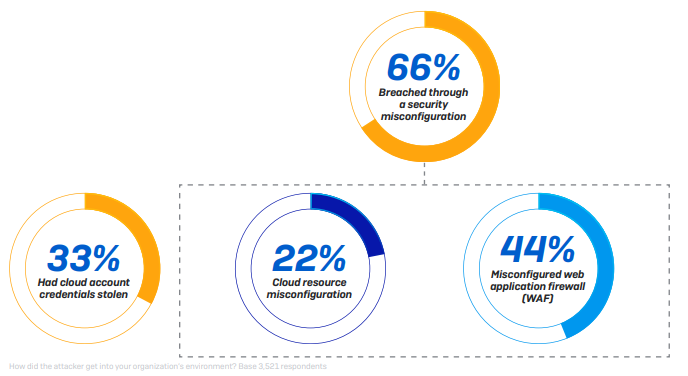
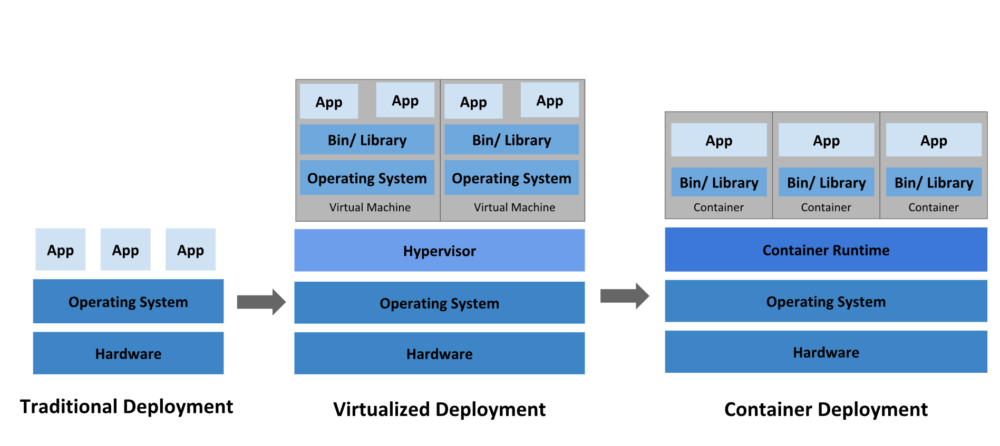

--- 
title: "FMISD13207 Cloud Security Technologies"
author: "Kęstutis Daugėla"
date: "`r Sys.Date()`"
output:
  pdf_document: default
  html_document:
    df_print: paged
bibliography: references.bib
biblio-style: apalike
link-citations: yes
site: bookdown::bookdown_site
citation_package: natbib
---

# Introduction {-}

*Topics from FMISD13207 Cloud Security Technologies module:*

**Information Security Fundamentals (information security problematics, classification and evolution of threats, identification, authentication, access control, security principals, strategies, models**, taxonomies and antologies); **Cryptography (simetric and public key cryptography**, DES, AES, **RSA**. stream ciphers, **cryptographic protocols, authentication, electronic signature, management of electronic identity**); **Network Security (routing, firewalls**, VPN, **web security**, **network perimeter protection, host-level protection**, **authentication technologies**); **Attacking Information Technology Systems (attack types, real-life case studies**, intrusion detection, formal analysis techniques); **Information Security Technologies** (antivirus, IDS, **host and perimeter protection systems**, Honeypots); **Implementing Effective Information Security Programs** (legal, regulatory and privacy issues, **security standards, security best practices, security policy**).

## Cloud Computing

The underlying concept of cloud computing was introduced way back in 1960s by John McCarthy in his book, “The challenge of the Computer Utility”. His opinion was that “computation may someday be organized as a public utility.” The rest became history and the majority of the software used now is running in the cloud seamlessly [@CloudHistoryOverview].


Cloud can solve a lot of problems nowadays - starting with reduced cost, enhanced security, and flexible approach [@CloudReview] up to sustainability [@CloudSustainability] and accessibility around the world. Continuous Integration and Deployment (CI/CD) is easier than even treating now only the applications, but the whole infrastructure as code. This leads to enhanced productivity and cost optimization [@CloudAutomation]. 

Is there anything revolutionary in the cloud offerings today? Definitely, no - people used these capabilities for ages. The only difference is the scale and popularity these days.

Cloud services usually are grouped into three categories:

* SaaS (Software as a service) is a software distribution model in which a cloud provider hosts applications and makes them available to end-users over the internet
* PaaS (Platform as a service) is a complete development and deployment environment in the cloud, with resources that enable you to deliver everything from simple cloud-based apps to sophisticated, cloud-enabled enterprise applications
* IaaS (Infrastructure as a service) is a type of cloud computing service that offers essential compute, storage, and networking resources on-demand, on a pay-as-you-go basis


However,  despite  the  gain  achieved  from  cloud computing, organizations are slow in fully accepting it due to security issues and  challenges associated with it [@Cloud-computing]. However, almost every cloud-ready company uses the public cloud (97%) to some extent leaving hybrid cloud setup the dominant one (78%). Companies rarely use public or private cloud alone (19% vs 2% respectively). According to Forbes, there are now 77 % of organizations, having one or some parts of their systems in the cloud. 


## Data Breach - Case Study

One of the main findings of the study [@databreaches] was that the most targeted type of organisation are medical organisations and Business Services Organisations since they possess the most sensitive personal data. Moreover, it was observed that in the recent years the frequency hacking breaches on the two sectors has intensified, with an inter-arrival time of 4 and 7.5 days respectively. These findings implies taking serious actions to secure personal data especially for MED and BSO organization [@databreaches]. Another public data breach dataset of the biggest hacks confirms these findings. 


|Sector     |   Attacks|     Number of records lost|
|:----------|---:|----------:|
|web        | 108| 7009835665|
|government |  44|  922822573|
|health     |  43|  174669929|
|finance    |  39| 1162050100|
|retail     |  35|  882555730|
|tech       |  23| 1590382232|
|telecoms   |  22|  837584000|
|app        |  21|  553259000|
|transport  |  16|  181626000|
|gaming     |  15|  224490755|
|academic   |  11|    5953000|
|misc       |  10|   90780000|
|military   |   5|   82227432|

Even such tech companies as Facebook, Twitter, Amazon, Twitch were hacked successfully making a considerable damage on their reputation and their clients.


The method's classification is not very precise and very overlapping; for example, what is termed a "oops!" could be classified as bad security or vice versa. On the other hand, hacking methods are not described, and hence we shall explore attack types in greater detail in the second chapter.


### Twitch

Twitch is a global community that comes together each day to create multiplayer entertainment: unique, live, unpredictable experiences created by the shared interactions of millions. Acquired by Amazon in 2014.


Twitch recently suffered a data breach that, according to security analysts, may have revealed extensive information about the platform's computer code, security vulnerabilities, and payments to content providers. According to the source, the file contained the history of Twitch's source code; proprietary software development kits; an unreleased competitor to Steam, an online games store; programs used by Twitch to test its own security vulnerabilities; and a list of the amount of money earned by each of the site's streamers since 2019 [NY Times - A ‘potentially disastrous’ data breach hits Twitch, the livestreaming site](https://www.nytimes.com/2021/10/06/technology/twitch-data-breach.html)

As another security professional indicates in [medium.com - Thoughts on the Twitch Breach](https://medium.com/cloud-security/thoughts-on-the-twitch-breach-a2840470387b): the attackers did not gain access through a zero-day vulnerability or a supply chain assault. Something existed in a state that was not compliant with or anticipated of it.

It appears that the problem was a misconfiguration as this statement says something was in error. The attackers did not get in due to a zero-day or supply chain attack. Something existed in a non-compliant or expected state. It sounds as though a server was running something on an Internet-facing port. However, the exposed data could have existed in an S3 bucket and all we know is that a server entered an undesirable state, which resulted in data disclosure. The misconfiguration could be as simple as a server being allowed excessive permissions and access, or as complex as a server being exposed to the Internet when it should have been in a private network.


Many people host their data on AWS and might be thinking, "If Amazon can’t keep data secure on AWS, who can?". 

Assess that you have zero-trust networking and permissions that provide persons and applications only the access they require. In an enterprise of that size, source control systems, if that is what was impacted in this case, should never be exposed directly to the entire Internet. Small enterprises may do so temporarily to stay afloat, but the majority of source control solutions allow you to restrict access to specific IP ranges.


### Phizer

Pfizer Inc., the world's largest pharmaceutical company, has experienced a massive data breach, with patient information discovered exposed on unprotected cloud storage.

The exposed data was discovered in a Google Cloud storage bucket that had been misconfigured. Hundreds of discussions between Pfizer's automated customer service software and consumers who used the company's prescription pharmaceuticals, including Lyrica, Chantix, Viagra, and cancer medicines Ibrance and Aromasin, were included in the data. Along with sensitive medical information, the transcripts included full names, home addresses, and email addresses, which hackers could use to conduct highly effective phishing attempts against victims: [Pfizer suffers huge data breach on unsecured cloud storage](https://pf-media.co.uk/news/pfizer-suffers-huge-data-breach-on-unsecured-cloud-storage/). It is evident that data storage in the public cloud has become the standard, and businesses of all sizes now face complicated identity and data management challenges. Capital One demonstrated, and Pfizer has confirmed, that even with the largest teams, funds, and skill sets, the public cloud is highly difficult. When corporate organizations move at the speed of the cloud and innovate at a breakneck pace, errors and data exposure are inevitable if the necessary technologies are not in place.

### Citybee

Lithuanian police were investigating after 110,000 people's personal information was exposed to an internet hacker website. CityBee, a car-sharing service, revealed that the breach compromised the records and information of thousands of its clients. [euronews.com - Thousands of CityBee users have their personal data leaked online](https://www.euronews.com/2021/02/17/thousands-of-citybee-users-have-their-personal-data-leaked-online). As the attacker stated, "CityBee was using a service provided by Microsoft called Azure Blob, which is used as storage of some sorts. Now Microsoft allows you to secure those blobs with authentication, which Citybee for some reason chose not to." He was able to search CityBee in a  DNS record called CNAME which linked to their azure blob and other things like their website. Even a [step-by-step instruction](https://kernal.eu/posts/citybee-leak/) was provided by the hacker. Essentially, it was a BACPAC file named CitybeeProduction, which contained the metadata and data from the database. Citybee also used a very weak SHA-1 encryption algorithm for passwords without any salt added.


On November 29, 2021, the Lithuanian data protection authority (VDAI) imposed a fine of EUR 110 000 on UAB Prime Leasing, which manages the short-term car rental platform “CityBee” (Company). VDAI found that it had failed to ensure the security of the processing of personal data.


# Cloud Cybersecurity Management

Cloud security is a critical matter. Most companies worry that highly sensitive data and intellectual property may be exposed through accidental leaks or due to increasingly sophisticated cyber attacks. Gartner predicts that through 2025, 99% of cloud security failures will be the customer's fault.

Capturing, keeping, and utilizing sensitive data is necessary for the majority of companies, yet holding and accessing it imposes the duty to secure it. Threat is frequently confused with or used interchangeably with "risk" and "vulnerability." In cybersecurity, however, it is essential to distinguish between threat, vulnerability, and risk. A threat exploits a weakness and can cause damage or destruction to an asset. A vulnerability is a flaw in your hardware, software, or operations while risk refers to the possibility of assets being lost, damaged, or destroyed.

## Cloud Security Overview

Cloud service providers follow a shared security responsibility model, which means that your security team retains some security duties as you migrate applications, data, containers, and workloads to the cloud, while the provider takes part, but not all, of the responsibility. Clearly defining your duties from those of your providers is critical for minimizing the risk of introducing vulnerabilities into your public, hybrid, or multi-cloud systems, as shown in the graph below.


Cloud challenges and directions have been categorized into 6 groups: Security, Autonomic Resource Management (ARM), Cloud Adoption, Cloud development and benchmarking big data technologies and cloud computing and social clouds. Security is the most common challenge of cloud computing as the paper indicates (which is the outcome of literature review of over 190 resources including books, journal and conference papers, research project reports and deliverables, European Commission roadmaps and calls for proposals, online weblogs, white papers, business reviews, company websites, profiles and offered services by cloud providers). [@cloudsecsurvey]


Having a solid cloud security stance helps organizations achieve other benefits, such as:

* Lower costs
* Reduced ongoing operational and administrative expenses
* Scalability
* Increased reliability and availability
* DevOps way of working


Despite bringing many benefits, the cloud computing paradigm imposes serious concerns in terms of security and privacy, which are considered hurdles in the adoption of the cloud at a very large scale [@securingcloudsurvey]. Security issues are depended on the cloud provider, service user, instance [@datasecurity], and the delivery model, PaaS, IaaS, and SaaS [@securitymode]. Data stored in the public cloud would face both outside attacks and inside attacks [@securityprivacy].  Data loss and leakage were the biggest security concern, with 44% of organizations seeing data loss as one of their top three focus areas. Two-thirds of organizations leave back doors open to attackers leading to an accidental exposure through misconfiguration. Security gaps in misconfigurations were exploited in 66% of attacks [@sophos]. 




Zero Trust security model enables securing cloud-native applications by encrypting all network communication, authenticating, and authorizing every request. The traditional trust management mechanisms represent a static trust relationship that falls deficit while meeting up the dynamic requirement of cloud services. [@zerotrust]. In order to achieve a true zero-trust security model in the cloud, a combination of network and identity permission policies should be in place.


To adequately address the modern dynamic threat environment requires[@NSA]:

* Coordinated and aggressive system monitoring, system management, and defensive operations capabilities.
* Assuming all requests for critical resources and all network traffic may be malicious.
* Assuming all devices and infrastructure may be compromised.
* Accepting that all access approvals to critical resources incur a risk

Some security recommendations for network security can be summarized as follows [@securingcloudsurvey]:

* Secure communication techniques should be adopted: HTTPS for web applications, transmission channel must be encrypted by TLS
* Additional monitoring should be done (manual, automatic, ML based)
* Other public security services such as web application firewalls (WAF), virtual firewalls, virtual bastion machines, virtual host protection, and virtual database audit systems could be used


## Infrastructure as Code 

There was a significant shift in development, deployment, and software application management during the past decade. The new approach is called Development Operations (DevOps) where Infrastructure as Code (IaC) plays a core role. While manual configurations in the Cloud context was a norm, nowadays it is fully automated using blueprints that are easily interpretable by machines. Moreover, IaC approach allows a faster and homogeneous configuration for the whole infrastructure. Usually, it is utilized by a specific declarative language (TerraForm, CloudFormation, Puppet) that allows users to describe the desired state of the infrastructure. This significantly reduces the time, complexity and helps to provision the infrastructure from the security, management, and costs perspectives. 


The whole idea behind IaC is simple - developers can write declarative statements that define the infrastructure necessary to run the code as opposed to writing a ticket/creating a task for administrators. Reproducibility and transparency come as a side effects.


Terraform is one of the most popular ways to implement this pipeline, especially in a Cloud context. It is an open-source tool that lets you provision Google Cloud resources with declarative configuration files-resources such as virtual machines, containers, storage, and networking. It lets users manage Terraform configuration files in source control to maintain an ideal provisioning state for testing, production, and other environments. [@iac]


## Type of threats

The literature has examined a variety of security threats [@threats]. To aid in comprehending some of the most prevalent cyber security weaknesses, the following are detailed:


* **Malware**. For the previous decade, malware attacks have been the most serious cyber security danger to many enterprises [@malware]. Malware The attacker uses malicious software to gain unauthorized access to computer systems by exploiting their security flaws. Malware is motivated by an extreme financial or political gain, which increases an attacker's drive to compromise as many network devices as possible in order to accomplish their harmful goals. Viruses, worms, trojans, backdoors and adware are but a few examples that fall under the umbrella of malware [@malware2].

* **DDoS**. Cyber security is comprised on three essential components: confidentiality, integrity, and availability. Denial of Service (DoS) attacks and their version, Distributed Denial of Service (DDoS), are conceivable threats that deplete system resources, rendering them inaccessible to authorized users, hence breaching one of the security components—availability. DoS attacks on networks are widespread and have the potential to be catastrophic. Numerous types of DoS attacks have been identified thus far, and the most of them are extremely efficient at disrupting network connectivity. Both IPv4 and IPv6 are quite vulnerable to these attacks [@ddos]. The frequency and scale of attacks have escalated in recent years, from a few megabytes to hundreds of gigabytes. It is difficult to identify these attacks efficiently due to changes in attack patterns or new forms of attacks [@ddos2]. 

* **Phishing** is a very effective approach of cybercrime that criminals use to fool consumers and steal critical data. Since the first phishing assault was disclosed in 1990, the attack vector has grown into a more sophisticated attack vector. At the moment, phishing is regarded to be one of the most prevalent forms of fraud on the Internet. Phishing attacks can result in significant losses for their victims, including sensitive data, identity theft, businesses, and state secrets. [@phishing]

* **SQL Injection Attack (SQLIA)** is one of the most terrifying risks to web applications. Input validation flaws were the cause of a SQL injection attack on the web. SQLIA is a harmful behavior that exploits invalid SQL statements in order to exploit data-driven applications. This vulnerability allows an attacker to exploit manipulated input to gain access to the application's back-end databases through the application's interaction with them. As a result, the attacker can acquire access to the database without obtaining genuine clearance by introducing, changing, or removing key information [@sqlia].

* **Man-in-the-middle**. An attack in which an outsider or third party infiltrates the space between two online users while both users are unaware. In this instance, the malware primarily monitors and has the capacity to modify the information classified exclusively to these two people. Generally, it is referred to as a protocol to refer to an unauthorized user within the system who has the ability to view and modify the system's data without leaving a trail for the system's existing users [@mitm].

* **Cross-site scripting** is a serious issue in Web Applications. With more connected devices that use a variety of Web Applications for various tasks, the potential of XSS assaults grows. By exploiting XSS vulnerabilities in Web applications, hackers can steal victims' session details or other sensitive information[@xss].


* **Zero-day exploit** continue to be a significant security concern to enterprises. When a vendor becomes aware of a zero-day vulnerability, releasing a fix in a timely manner becomes a priority due to the possibility of zero-day exploits. However, we continue to lack knowledge on the factors that influence the time it takes for such vulnerabilities to be patched. It was discovered that while IT companies are quick to release timely updates for zero-day vulnerabilities that affect multiple vendors, products, and versions, vulnerabilities that require privileges and compromise confidentiality are less likely to be patched on time. [@zeroday]. 

* **BEC (Business Email Compromise)** is a sophisticated email fraud scheme that targets firms who deal with international suppliers and frequently transfer payments via wire transfers. BEC attacks are designed to eliminate security protections by capitalizing on flaws in human behavior and decision-making [@BEC]. 

## Vulnerabilities

Vulnerabilities are weak points in the environment and assets, which expose you to possible threats and heightened risk. Unfortunately, a company can have thousands, and frequently millions, of vulnerabilities. It is not possible to remediate all of them, given that most businesses can only patch one out of every 10 vulnerabilities. However, the good news is that just 2 to 5 percent of vulnerabilities are likely to be exploited. Even fewer of these vulnerabilities are likely to constitute a real threat to your company, as many of them may not be actively exploited in your industry.

Depending on the cloud service model, vulnerabilities might differ, as described in the table below.

![Layerwise threats vulnerabilities and solutions [@threatsvulnerabilities]](img/vulnerabilities_table.png)

## Risks

Customers are supplied cloud services, however they are dissatisfied owing to vulnerabilities and risks in the distributed cloud environment. The SaaS is vulnerable to assaults such as denial of service and consumer data manipulation. The solution mechanisms for SAAS are trace back filters and Web application scanners. IaaS is susceptible to threats such as VM escape and malicious VM formation, for which there are solutions such as hypersafe, TCCP, and mirage. The attacker can also conduct attacks on PaaS, such as account or service hijacking and data leakage, using solution mechanisms such as identity and access management guidelines, dynamic credential and FRS approaches, digital signatures, and homogeneous encryption. Although many individuals develop assault protection techniques, there is no silver bullet to defend the cloud against ever-changing technology, intelligent attackers, and incompetent coders [@threatsvulnerabilities].

# Paper review

## Security Challenges in Different Network Layers

A Comprehensive Survey on Security Challenges in Different Network Layers in Cloud Computing [@cloudseclayers]

Since cloud customers have shifted the security risks associated with their cloud-deployed systems and data to the cloud service provider. The disadvantages of transferring risks to the cloud service provider include unauthorized access to cloud users data. As a result of these security difficulties and other non-technical obstacles, such as cloud service providers mistrust of cloud customers, cloud service applicants are hesitant to adopt cloud services immediately. Using the five layers of computer networks, cloud computing deployment patterns, and the client and server layers services, the purpose of this paper was to investigate, analyze, and classify the security issues, vulnerabilities, and threats of cloud computing. Several solutions and preventative measures for establishing long-term security in the cloud computing environment were presented in this paper as long with a complete analysis of cloud computing, its architecture,  services, and implementation techniques. In accordance with the recommended classification, security issues were also identified and categorized. Security requirements and preventive measures were proposed to assure the safety of user data against a variety of threats and reduce the risk.

This article discusses how security responsibilities varies between three main service models (SAAS, PAAS, IAAS) and how responsibility shifts between the vendor and the customer. While in SaaS case the user does not have control of cloud infrastructure, the whole network must meet network security and availability demands in order to prevent unauthorized users and DooS attacks. In PAAS case, user have more control on the application level, but still lacks some networking and storage configuration capabilities. IaaS puts the user in control of OS, network, storage and other cloud resources. In terms of the deployment models, public cloud poses the most risk while being the cheapest option in terms of the infrastructure costs and flexibility.

Network security layers were decoupled into five sections: perimeter, network, host, application, data. The perimeter layer connects user to the cloud environment, therefore it is prone to external threats. Solutions for that are Web Application Firewall and implemented Intrusion Detection System. Network layer, however, are mostly facing misconfiguration issues (e.g. opened ports, security patches not implemented, insecure protocols) and these security holes can enable users to reach the host level. It is important to isolate servers and storage logically in order to secure the network layer. Proper logging is also essential for detecting malicious behavior. Host level is susceptible to existing vulnerabilities, depending on the software hosted by the VM. Also it mandatory to ensure proper authentication mechanisms to a VM (e.g. LDAP, AD, SSO). The same part is applicable for the application level: bypassing the authentication or brute forcing the way are one of the most common attacks. On the last data layer, it is important to solve both - the communication and the storage security challenges. The full list of security challenges of different layers of the computer network are provided in the table below together with the probablities and the impact.


![Classifcation of security challenges of different layers of computer network [@cloudseclayers]](img/a-security-challenges.PNG)


## Anomaly detection for Cloud Applications

Machine Learning for Cloud Security: A Systematic Review [@mlcloud]

# Project Scope

## Platform for anatical applications

Shiny Server is a powerful open source back end application. It creates a web server optimized for hosting Shiny applications. Shiny Server enables you to host your apps in a controlled environment, such as within your corporation, ensuring that your Shiny app (and any data it requires) never leaves your control.

The majority of Shiny apps are deployed within an organization's firewall, and because you can generally trust that your colleagues will not attempt to hack your app64, you don't need to worry about security. If, on the other hand, your app contains data that only a subset of your colleagues should have access to, or if you wish to make your app publicly accessible, you will need to invest some effort in security. When it comes to app security, there are two critical components to safeguard: your data and your compute resources.


While Shiny Server has [some security features](https://docs.rstudio.com/shiny-server/#authentication-security), the open source version is pretty basic: it does not have authentication, TLS/SSL (traffic is not encrypted), there's no defense to a denial of service attack and there is no way to distribute work for multiple R instances. However, some companies, e.g. [Appsilon](https://appsilon.com/) are specializing in enterprise Shiny dashboards using the open source version. We will attempt to establish a similar secure infrastructure in this project and to expose shiny applications to the world wide web as well.


## Kubernetes and Docker

The Open Source Shiny Server is a stand-alone application that runs on a single thread. While it is feasible to run many instances of shiny servers and divide work via load balancing, this is inefficient and far more expensive than using containerized applications. While it is possible to create the shiny-server container from scratch, there are a lot of pre-build [docker images](https://hub.docker.com/r/rocker/shiny) available including all the dependencies. Moreover, virtualized applications are highly preferred in general as opposed to IaaS approach (virtual machines), it makes sense to dig deeper in kubernetes and docker setup, regardless of the chosen service provider. 



Kubernetes was founded by Ville Aikas, Joe Beda, Brendan Burns, and Craig McLuckie in collaboration with Google engineers Brian Grant and Tim Hockin in mid-2014. Google's Borg system heavily influenced kubernetes design [@Borg] [@BorgKubernetes]. While the Borg project was implemented entirely in C++, Kubernetes was rewritten in Go language. The main goal of kubernetes was to build on the capabilities of containers and provide significant gains in programmer productivity while easing the management of the system. 


Kubernetes is the most popular container orchestration platform that enables users to create and run multiple containers in cloud environments. Kubernetes offers resource management to isolate the resource usage of containers on a host server because performance isolation is an important factor in terms of service quality.


Environments running Kubernetes consist of the following key components:


* Kubernetes control plane—manages Kubernetes clusters and the workloads running on them. Include components like the API Server, Scheduler, and Controller Manager.
* Kubernetes data plane—machines that can run containerized workloads. Each node is managed by the kubelet, an agent that receives commands from the control plane. 
* Pods—pods are the smallest unit provided by Kubernetes to manage containerized workloads.  A pod typically includes several containers, which together form a functional unit or microservice.
* Persistent storage—local storage on Kubernetes nodes is ephemeral, and is deleted when a pod shuts down. This can make it difficult to run stateful applications. Kubernetes provides the Persistent Volumes (PV) mechanism, allowing containerized applications to store data beyond the lifetime of a pod or node.


## Shiny Server Security Experiment

Computer networks are prone to attacks and it has a wide range of attacks associated with them. Cloud is not an exception and even holds more risk. It can be prone to Denial-of-service, Eavesdropping, Host Attacks, Password Guessing, Protocol-based, and Social Engineering attacks [@attacks].

As an experiment, the firewall was opened to the whole world and network activity was monitored for one week. While the activity in the Compute Instance (Shiny Server hosted on a Virtual Server) was marginal, the exposed Shiny Server instance on Google Kubernetes Cluster was scanned extensively. This could be due to the rules on how Google generates IP addresses for corresponding instances. Moreover, GKE was exposed on port 80 which is a standard HTTP port, while the standard port of shiny server (3838) was used for Compute Instance, which is not that common configuration.


While the majority of the requests came from the USA, applications from China and Russia also scanned our exposed application considerably. These scans also are not centralized but are rather done by individuals or companies which specialize in data mining and web crawling. Some requests are also received from Lithuania, CGates Internet Service Provider. 


Some of the IPs were crossed check with a publicly available IP database. These IP addresses, especially from China and Russia, were already reported a number of times and are indicated as abusive. 


The analysis proves that an incorrectly configured firewall poses one of the most significant security risks. Misconfigured applications could serve as a back door and is a low handing fruit for hackers - e.g. it is easy to run a port scan for a specific IP range and use a collection of scripts/exploits to check whether there are any holes in the application. If any sensitive data where General Data Protection Regulation is not applied (i.e. USA, China, Russia).


## Security considerations

### Data Encryption

TLS (Transport Layer Security) encrypts data transmitted over the Internet, ensuring that snoopers and hackers cannot view what you transmit. This is especially important for private and sensitive information such as passwords, credit card numbers, and personal communications. TLS originated from Secure Socket Layers (SSL), which was originally created to secure web sessions in 1994 by Netscape Communications Corporation. SSL 1.0 was never released publicly, while SSL 2.0 was rapidly superseded by SSL 3.0, the foundation for TLS. Historically, data was transferred unencrypted over the Internet, and encryption was often applied piecemeal to critical information such as passwords or payment information. Without TLS, not only may sensitive information such as usernames, passwords, and personal information be easily gathered, but also surfing habits, e-mail conversations, online chats, and conference calls can be observed. By enabling TLS support in client and server apps, it ensures that data exchanged between them is encrypted using secure algorithms and is inaccessible to third parties.

TLS is the most frequently used encryption protocol in the internet. It is composed of two protocols: the TLS Handshake Protocol, which is responsible for authentication and key establishment, and the TLS Record Protocol, which is responsible for the subsequent usage of those keys to secure bulk data. SSL/TLS protects the confidentiality and integrity of data-in-transit by utilizing both asymmetric and symmetric encryption. Asymmetric encryption is used to establish a secure connection between a client and a server, and symmetric encryption is used to exchange data within the secured connection.


At a high level, TLS is split into two phases:

* A handshake phase where a secure communication is negotiated and created between two participants.
* A post-handshake phase where communications are encrypted between the two participants.


TLS 1.2 and earlier versions perform the key exchange once both parties agree on the key exchange algorithm to use. This means they first agree on a method to utilize before exchanging public keys.


To eliminate the first round of negotiation (one client message and one server message) in TLS 1.3, the client transmits a public key speculatively in the very first message (the Client Hello). If the client is unable to correctly forecast the server's key exchange mechanism, the client must send a new Client Hello with the right public key. TLS 1.3 contains numerous such enhancements that are critical for the web. Indeed, many people have insecure or poor connections, making it critical to restrict non-application communication to a bare minimum. Additionally, unlike prior versions of TLS, all key exchanges in TLS 1.3 are ephemeral. This means that for each new session, both the client and server generate new key pairs and then delete them immediately after the key exchange is complete [@wong].


The handshake itself contains of these following steps:

* Negotiation. TLS is highly configurable. Both a client and a server can be configured to negotiate a range of SSL and TLS versions, as well as a menu of acceptable cryptographic algorithms. The negotiation phase of the handshake aims at finding common ground between the client’s and the server’s configurations, in order to securely connect the two peers.
* Key exchange. The whole point of the handshake is to perform a key exchange between the two participants. What key exchange algorithm to use? This is one of the things decided as part of the negotiation process.
* Authentication. It is trivial for a MITM attacker to impersonate any side of a key exchange. For this reason, key exchanges must be authenticated. (Your browser must have a way to make sure that it is talking to google.com and not your Internet service provider, for example.)
* Session Resumption. As browsers often connect to the same websites again and again, key exchanges can be costly and slow down a user’s experience. For this reason, mechanisms to fast-track secure sessions without redoing a key exchange are integrated into TLS.

 An example of TLS 1.3 a negotiation could be:

```
* The client sends a TLS 1.3 Client Hello announcing that it can do either an 
* X25519 or an X448 key exchange together with a X25519 public key.
* The server does not support X25519, but does support X448. 
* It sends a Hello Retry Request to the client announcing that it only supports X448. 
* The client sends the same Client Hello but with an X448 public key instead. 
* The handshake goes on.
```

RSA and the Diffie-Hellman Key Exchange are the two most widely used encryption algorithms, each of which solves the same problem in a somewhat different way. In a nutshell, the Diffie Hellman technique generates a public and private key for each party to the transaction but shares only the public key. Unlike Diffie-Hellman, the RSA algorithm can be used for both digital signatures and symmetric key exchange, although it does need the prior exchange of a public key. RSA stands for Ron Rivest, Adi Shamir, and Leonard Adleman—the three men who initially publicly defined the approach in 1977. RSA is based on the assumption that factoring really large integers is difficult (integer factorization). On the assumption that there is no efficient solution for integer factorization, it is thought that decrypting an RSA ciphertext completely is infeasible. A user of RSA generates and then publishes their public key, which is composed of two enormous prime integers and an auxiliary value. The primary variables must remain unidentified. While anyone can use the public key to encrypt a message, only someone familiar with the prime factors is likely to be able to decrypt it.

The browser, on the other hand, verify that the handshake is happening between the client and specific website using the Public Key Infrastructure. Firstly, browsers must trust a set of root public keys - Certificate Authorities (CAs). Typically, browsers will either utilize a hardcoded list of trusted public keys or will request them from the operating system. Websites wishing to utilize HTTPS must be able to receive certification from one of these CAs (a signature of their signing public key). In order to do this, a website owner must prove to a CA that they own a specific domain. CAs do not directly sign public keys but rather sign certificates. A certificate contains both the long-term public key and some crucial metadata, such as the domain name of your web page, if you have one. To ensure that the server connecting with a browser is genuine, the server includes a certificate chain in the TLS handshake. This certificate chain is sent in a Certificate TLS message by the server, and by the client as well if the client has been asked to authenticate. The server sends this certificate chain in a Certificate TLS message, as does the client if the client is prompted to authenticate. Following the establishment of a handshake and the generation of symmetric keys, both the client and server can exchange encrypted application data. Additionally, TLS prevents reordering of such communications.

### Single Sign On

Authentication and trust mechanisms are needed by the user and provider alike. In this scenario, SSO could be a good starting point. The spam e-mail problem can be also mitigated in the cloud. Despite their frequent interchangeability, authentication and permission serve fundamentally distinct purposes. Authentication is the process of validating a user's identity, whereas authorization is the process of checking the user's access rights. As a general recommendation, the SSO (Single Sign-on) and CAS (Central Authentication Service) should be also activated to make a user to access various software services through a single active user account. [@cloudseclayers]


SAML and OAUTH2 are two of the most popular Single Sign-On implementation methods.

#### SAML

SAML is an abbreviation for Security Assertion Markup Language (SAML). Its principal function in terms of online security is to permit access to different web applications with a single set of login credentials. It operates by exchanging authentication data between two parties, often an identity provider (idP) and a web application. Web applications utilize SAML to send authentication data between two parties - the identity provider (IdP) and the service provider - in an XML-based format (SP). SAML was developed by the technology sector to ease the authentication procedure for users requiring access to various, independent web apps across domains. Single sign-on (SSO) was possible before SAML, but it relied on cookies that were only valid within the same domain. It accomplishes this by centralizing user authentication through an identity provider. Then, Web apps can utilize SAML via the identity provider to provide their users access. This SAML authentication method eliminates the need for users to memorize numerous login credentials. It also benefits service providers because it enhances the security of their own platform, especially by eliminating the need to retain (often insecure and weak) passwords and eliminating forgotten password difficulties. SAML V1.0 became an OASIS standard in November 2002. SAML V1.1 followed in September 2003 and has seen significant success, gaining momentum in financial services, higher education, government, and other industry segments. SAML is an important standardized example of this new protocol class and will be widely used in business-to-business scenarios to reduce user-management costs. [@SSOSAML]. 


Even though SSO reduces the number of logins that are needed over heterogeneous environments, the risk that might be associated with the security of SSO might be detrimental if, for example, a Man-in-the Middle (MITM) attacker manages to gain control of the SSO credentials. The problem that a paper addresses is the lack of a proactive technique of hardening cloud-based SAML while combining SSO with a Multi-Factor Authentication (MFA)  [@SAMLSEC]. 

with Redirect/POST Bindings and to the protocol which is distributed and used by Google’s partner companies to get full control over the authorization and authentication of hosted user accounts that can access web-based applications like Gmail or Google Calendar [@SAML] 


SAML, however, provides a feature that OAuth2 does not: the SAML token contains user identification information (because of signing). With OAuth2, this is not provided by default; instead, the Resource Server must make an additional round trip to the Authorization Server to validate the token.

#### OAuth2

OAuth 2.0 (henceforth OAuth2) is a much more recent specification than SAML (circa late 2012). It has the advantage of being recent and takes into account the changes in the world during the past eight years. OAuth2 offers a simpler and more standardized solution that satisfies all of our existing requirements and eliminates the need for interoperability workarounds with native applications.


OAuth 2.0 is one of the most extensively used authorization/single sign-on (SSO) protocols and serves as the foundation for the new SSO standard OpenID Connect. OAuth 2.0 is also popular for cloud-based online services and is used by many large companies, like Google, Facebook, and Microsoft, to allow restricted access to data. OAuth 2.0 has a flexible architecture and may be implemented and customized in a variety of ways based on the use case. 


Nevertheless, each of these implementation decisions and configuration options has its own security implications. Despite OAuth's popularity, analysis attempts to date have focused primarily on discovering faults in individual implementations and have relied on formal models that abstract from numerous web aspects or have not provided a formal approach.

four major attack types are still feasible if the security recommendations and certain best practices are followed, e.g. 307 redirect attack, IdP mix-up attack, state leak attack, and naive RP session integrity attack [@oauthsec]. In addition to the current approach of basic authentication via client secret, it is recommended to add 2FA (Two Factor Authentication) as a feature for third-party client app authentication. [@oautharch]

### Network

Providing secure services requires the setup of cloud infrastructure security policies appropriately. After gaining access to this equipment, they are able to attack the host layer's weaknesses and conduct malicious operations in this layer. All configurations should be recorded, maintained, and monitored under scheduled programs to prevent any error or misconfiguration which is fairly easy to achieve using the cloud services and infrastructure as code approach.  

Logging the events such as successful/unsuccessful access of the users to the equipment, configurations, and malicious traffics, and storing the logfiles on a separate server with limited access over a long period of time. Logging events such as successful/failed user access to equipment, configurations, and malicious traffic, and storing logfiles on a separate server with restricted access for an extended period of time [@cloudseclayers].

When it comes to networking, logical isolation makes a VPC environment inherently more secure. However, public cloud security isn't automatic, even with VPC – it must be intentionally deployed. Cloud security is always a shared responsibility between a cloud provider and its clients.


# Project Implementation GCP

## Shiny Application

Several shiny R applications were created for this project. The authentication part could be either shifted for the identity aware proxy or implemented in the application, as in example below.

```
library(shiny)
library(googleAuthR)
gar_set_client(activate="web", web_json = "client.json", scopes = "https://www.googleapis.com/auth/webmasters")
ui <- fluidPage( 
  titlePanel("Sample Google Sign-In"),  
  sidebarLayout(
    sidebarPanel(
      googleSignInUI("demo")
    ),    
    mainPanel(
      h3("test"),
      with(tags, dl(dt("Name"), dd(textOutput("g_name")),
                    dt("Email"), dd(textOutput("g_email")),
                    dt("Image"), dd(uiOutput("g_image")) ))
    )
  )
)
server <- function(input, output, session) {  
  sign_ins <- shiny::callModule(googleSignIn, "demo")
  output$g_name = renderText({ sign_ins()$name })
  output$g_email = renderText({ sign_ins()$email })
  output$g_image = renderUI({ img(src=sign_ins()$image) })  
}
shinyApp(ui = ui, server = server)
```

While Shiny application could be hosted with the default config on any VM, websockets needs to be disabled for running shiny Google Cloud Run. 

```
disable_protocols websocket xdr-streaming xhr-streaming iframe-eventsource iframe-htmlfile xdr-polling iframe-xhr-polling;
run_as shiny;
server {
  listen 8080;
  location / {
    site_dir /srv/shiny-server;
    log_dir /var/log/shiny-server;
    directory_index off;
  }
}
```

## Conteinarization

In order to dockerize shiny application, we will be using a docker image from rocker repository. Since the image is packaged with all the dependencies, we only need to add dependend packages ("googleAuthR") and move required files to the container (shiny server configuration, client secret and the application itself).

```
FROM rocker/shiny
RUN apt-get update && apt-get install -y \
libcurl4-openssl-dev libssl-dev \
&& apt-get clean \
&& rm -rf /var/lib/apt/lists/ \
&& rm -rf /tmp/downloaded_packages/ /tmp/*.rds
RUN install2.r --error \
    -r 'http://cran.rstudio.com' \
    googleAuthR
COPY shiny-customized.config /etc/shiny-server/shiny-server.conf
COPY client.json /srv/shiny-server/client.json
COPY app.R /srv/shiny-server/app.R
RUN chmod -R 775 /srv/shiny-server/
EXPOSE 8080
USER shiny
CMD ["/usr/bin/shiny-server"]
```

In order to build a docker container and push the image to the Google Container registry, these commands are utilized. It is possible to automate the pipeline and build container from source (e.g. project github repository), but this feature was outside the scope of the project.

```
gcloud auth login --project {project id}
PROJECTID=$(gcloud config get-value project)
docker build . -t gcr.io/$PROJECTID/signin
docker push gcr.io/$PROJECTID/signin
```

For debugging purposes, application can be launched locally:

```
docker run --rm -p 8080:8080 gcr.io/$PROJECTID/simpleauth:latest
```


### Terraform

Since we are following Infrastructure as Code pattern, the whole required infrastructure could be defined in a terraform file. We need to select project, region, service and add application deployment config. In case of Cloud Run deployment, terraform file can be defined like this:

cloudrun-shiny.tf

```
provider "google"{
 project     = "shiny-cloud-project"
 region      = "europe-west1"
}

resource "google_project_service" "run" {
  service = "run.googleapis.com"
}

resource "google_cloud_run_service" "shiny-simple-signin" {
  name = "shiny-simple-signin"
  location = "europe-west1"
  template {
    spec {
      containers {
        image = "gcr.io/shiny-cloud-project/signin:latest"
        resources {
          limits = {
            cpu = "1000m"
            memory = "1024Mi"
          }
        }
        ports {
          container_port = 8080
        }
      }
      container_concurrency = 80
      timeout_seconds = 300
    }
    metadata {
      annotations = {
        "autoscaling.knative.dev/minScale" = 0
        "autoscaling.knative.dev/maxScale" = 1
      }
    }
  }
  traffic {
    percent = 100
    latest_revision = true
  }
  depends_on = [google_project_service.run]
}

resource "google_cloud_run_service_iam_member" "allUsers" {
  service  = google_cloud_run_service.shiny-simple-signin.name
  location = google_cloud_run_service.shiny-simple-signin.location
  role     = "roles/run.invoker"
  member   = "allUsers"
}

```

It is convenient to print shiny app URL after the deployment, thus output value is added in outputs.tf: 

```
output "url" {
  value = google_cloud_run_service.shiny-simple-signin.status[0].url
}
```

Terraform is initiated using the init command, plan command will generate the plan and apply command will push the changes of the infrastructure. After that terraform will hold state regarding your infrastructure and configuration management. Terraform uses this state to map real-world resources to the configuration, keep track of metadata, and optimize efficiency for huge infrastructures. While it is preferred to store the state centrally (e.g. GCS bucket), this was also outside of the project scope. 

```
terraform init
terraform plan
terraform apply
```


### Cloud Run


### GKE


## Shiny R Applications


## Security Measures

### Load balancing


### DNS


```
gcloud beta dns --project=$PROJECTID managed-zones create shinycloud-online --description="" --dns-name="shinycloud.online." --visibility="public" --dnssec-state="off" --log-dns-queries
```


### Certificates


### Identity aware proxy


### Audit


## Final result


* https://shinycloud.online/ - main public app (only google Sign In)
* https://login.shinycloud.online/ - private app (Google OAuth + identity aware proxy)
* https://gke.shinycloud.online/ - scalable app (identity aware proxy only)
* https://_____.shinycloud.online/ - any new app, depending on the security and scalability requirements


```
All apps will be terminated on 2022-06-20
```

# References {-}

